# Omnigit

[](https://github.com/Polemus/Omnigit/actions/workflows/ci.yml)
[](https://github.com/Polemus/Omnigit/releases/latest)
[](LICENSE)

**A desktop Git client that isn't tied to GitHub.**

Most Git GUIs are built around one hosting site and treat the rest as an afterthought.
Omnigit talks to **GitHub**, **Gitea**, **Forgejo** and **GitLab** out of the box — including
self-hosted instances behind your own domain — and to anything else you describe in a JSON
file, with no code.

Runs on **Linux, Windows and macOS** from a single codebase. **No Git installation
required** — the native library ships inside the app, and the app keeps itself up to date.

> **Status: working, not finished.** Omnigit reads and writes real repositories and is used
> to develop itself. Pull requests are listed, checked out and opened from the app; reviewing
> and merging them, and issues, aren't implemented yet.

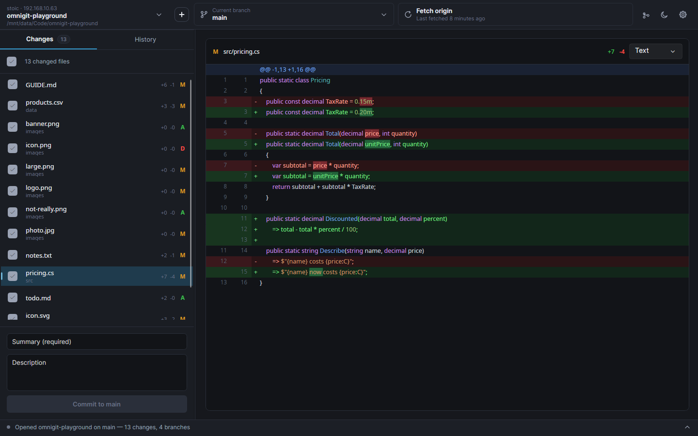

## Install

**[Download the latest release →](https://github.com/Polemus/Omnigit/releases/latest)**

| Platform | Take this one |
| --- | --- |
| Windows | `winget install Polemus.Omnigit`, or the `-setup.exe`, or the `.zip` for a portable copy |
| Debian, Ubuntu, Mint | `.deb` |
| Fedora, RHEL, openSUSE | `.rpm` |
| Any Linux, sandboxed | `.flatpak` — `flatpak install ./Omnigit-*.flatpak` |
| Any other Linux | `.AppImage` — `chmod +x` it and run it, nothing to install |
| macOS | `.dmg` — drag Omnigit to Applications |

Both x64 and arm64 for Linux and macOS; Windows is x64.

**macOS builds are signed and notarised** — the disk image opens and the app launches with
nothing to click past. **Windows builds are unsigned**, so the first launch needs one nudge:
*More info* → *Run anyway*. For the portable `.zip` you may also need right-click the
`.exe` → *Properties* → **Unblock**.

**Updating is one button.** Settings → About shows what changed in the newest release and
an **Update now** that downloads it, checks it against the release's published checksums,
installs it and restarts Omnigit. A dot on the settings button says when there is one. The
`.deb` and `.rpm` go through `apt` or `dnf` (after your system's password prompt), so the
package manager still knows what is installed. The Flatpak is the exception — the sandbox
can't replace itself — so for that one, download the new `.flatpak` and install it over the
old.

The AppImage adds itself to your applications menu on first run, so the dock shows its own
icon rather than a generic one. `OMNIGIT_NO_DESKTOP_INTEGRATION=1` skips that.

## What it does

**Everyday Git work**

- Working-tree status with real diffs — modified, added, deleted, renamed and untracked
- Selective staging and committing, with the author from that repository's own config
- Branch creation, switching and checkout — including branches that so far exist only on
  the server, which are checked out as a local branch tracking them
- A branch picker that filters as you type and groups branches the way GitHub Desktop does:
  default, recent, the rest, then the ones only on the remote
- **One sync button** that proposes whatever the branch needs — publish, pull, push or
  fetch — and shows commits ahead and behind at the same time. Push, pull and fetch are
  also on `Ctrl+P`, `Ctrl+Shift+P` and `Ctrl+Shift+F`
- A commit graph of every branch, beside the history
- **Fetches on its own** every ten minutes and when you open a repository, quietly, so the
  ahead/behind counts mean something without you pressing anything
- Reopens the repository you were last in

**Diffs that aren't only red and green lines**

Every changed file is shown by a *viewer*, and a picker above the diff switches between the
ones that fit it.

- **Text** — the unified diff, with the words that changed within a line picked out, so a
  one-character fix doesn't read like a rewrite. **Side by side** is one choice away.
- **Images** — PNG, JPG, GIF, BMP, WebP and SVG: the old picture under the new one, with a
  **swipe** you can drag across it or an **onion skin** that fades between them.
- **Packages** — a lockfile as the list of packages that were updated, added or removed,
  with major-version bumps called out. `package-lock.json`, `yarn.lock`, `pnpm-lock.yaml`,
  `Cargo.lock`, `poetry.lock`, `uv.lock`, `Gemfile.lock`, `composer.lock`, NuGet's
  `packages.lock.json`, `go.sum` and `Pipfile.lock`.
- **Table** — CSV and TSV as a grid, with the changed cells marked and unchanged rows
  folded away.
- **Rendered** — Markdown as it will look, with each changed block marked in the margin.
- **Plugins** — anything else. See [Plugins](#plugins) below.

Nothing a viewer shows can reach outside the repository: images in a Markdown file are shown
as their alt text rather than fetched, and an SVG's references to other files and URLs are
stripped before it is drawn.

**The bits other clients make you leave for the terminal**

- **Switching branches with uncommitted work asks first.** Bring everything, leave
  everything, or tick individual files — whatever stays behind is stashed against the
  branch you came from, and offered back when you return to it.
- **Conflicts are finished in the app.** When a merge, revert or cherry-pick stops, a panel
  lists what's stuck, shows each conflicted file with both sides and the difference picked
  out, and offers three answers: keep mine, take theirs, or fix it by hand and mark it
  resolved. Committing finishes the operation; abandoning puts
  everything back.
- **A commit menu that matches GitHub Desktop's**, bar reordering — amend while it's still
  local, reset (explained in words rather than Git's), open a commit, undo it, branch from
  it, tag it, cherry-pick it onto another branch, or open it on the site it came from.
- **Discard, or add to `.gitignore`** — select several files and discard them in one go,
  or ignore a file, its folder or its extension, with only the options that apply offered.
  Double-click a file to open it in whatever your desktop opens it with.
- **Removing a repository from the list is not deleting it.** Removing leaves the folder
  alone; *Move to trash* uses the desktop's own trash and first counts what would be lost
  — uncommitted changes, unpushed commits, an unpublished branch, stashes.

**Living with more than one hosting site**

- **New repository** (`Ctrl+N`) asks for a name, a README, a `.gitignore`, a licence — and
  where to publish it. Leave that at *nowhere yet* and it's created and committed locally;
  pick a site and the same press creates it there, as private or public and under you or an
  organisation, and pushes. A repository that has never been published shows **Publish
  repository** on the sync button.
- **Pull requests in the branch picker.** A second tab lists the open ones for the
  repository — checking one out fetches its head and lands you on `pr/<number>`, even when
  it came from someone's fork, with no second remote to add. **Create pull request** pushes
  the branch if the site hasn't seen it yet and then opens that site's own form.
- **Browse and clone** everything your signed-in accounts can see, from every site at once
- **Repositories grouped by where they actually came from**, read from the `origin` URL
- **Sign in with your browser** on github.com, or a personal access token anywhere
- **Tokens go to the OS keychain**, never into a settings file

**Around the edges**

- Dark and light themes, switchable at runtime
- Translatable, with a language picker that takes effect without a restart — see
  [Translating](#translating)
- An activity console that says what the app is doing, and expands itself on an error
- Refreshes itself when you commit in a terminal or save in an editor
- Resizable panes that remember their sizes

## How it works

**Hosting sites are JSON, not code.** Adding a site needs no code: **Settings → Hosting
sites → Add a site** asks which URL lists repositories and which field holds the name, tests
it against the real server, and the site works immediately without a restart. What the form
writes is an ordinary file in `~/.config/Omnigit/hosts/`, editable afterwards and identical
to one you'd write by hand — see [docs/host-manifests.md](docs/host-manifests.md).

A manifest is data and cannot execute anything. That's the point: a hosting site is handed
tokens that can read and write all of your source code, and code loaded to talk to it could
send every one of them anywhere. Gitea and GitLab ship *as* manifests deliberately, so the
format is exercised by Omnigit's own code rather than rotting into something that only works
in theory. GitHub is C# only because its browser sign-in is a multi-step conversation that
endpoint descriptions can't express.

**Tokens never touch a settings file.**

| Platform | Where tokens live |
| --- | --- |
| Linux | system keyring via `secret-tool` (libsecret) |
| macOS | login Keychain via `security` |
| Windows | DPAPI, encrypted to your login |
| fallback | a `0600` file — the app says so plainly when it has to use this |

`accounts.json` holds only the harmless half: site, login, display name.

**No Git installation required.** LibGit2Sharp bundles native `libgit2`, and because Omnigit
publishes self-contained, it ends up inside every installer along with the .NET runtime.
HTTPS with a token is the path Omnigit is built and tested around, and it works everywhere.
The bundled library is also built with SSH support on Linux and macOS; the Windows build of
it has none.

**Built with** Avalonia 12 on .NET 10, rendering through Skia rather than wrapping native
controls, so it looks and behaves identically on all three platforms. Git via LibGit2Sharp
0.32, MVVM via CommunityToolkit.Mvvm, styling via FluentAvalonia, Markdown parsing via
Markdig and SVG via Svg.Skia.

## Plugins

A plugin adds a new way to show a changed file — a spreadsheet as a grid, a game engine's
scene as a tree of nodes, anything a desktop control can draw. Omnigit's own viewers are
written against exactly the same interface, so a plugin is a peer of the built-ins rather
than a guest.

A plugin is a .NET assembly in a folder under the plugins directory, with a small
`plugin.json`. **Settings → Plugins** lists what's installed, and **nothing runs until you
switch it on**. There is no store and nobody reviews plugins: a plugin runs inside Omnigit
with the same access Omnigit has, so install ones you trust, as you would any program.
Omnigit hands a viewer only the file it is showing — never anything about your accounts.

[docs/plugins.md](docs/plugins.md) has the whole interface, and `samples/SizeViewer` is a
complete plugin in about sixty lines.

## Screenshots

Rendered from the real app against real repositories by `tools/Screenshots/run.sh`, so they
can be regenerated whenever the interface changes rather than drifting out of date.

**History — the commit, its files, and the diff with the syntax coloured**

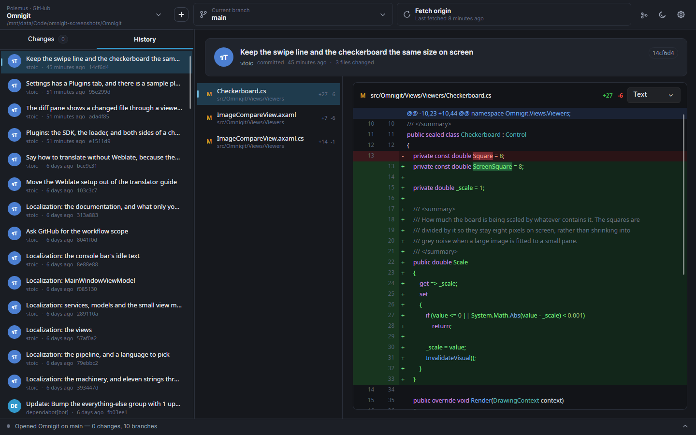

**The commit graph — every branch, and where each one left and rejoined**

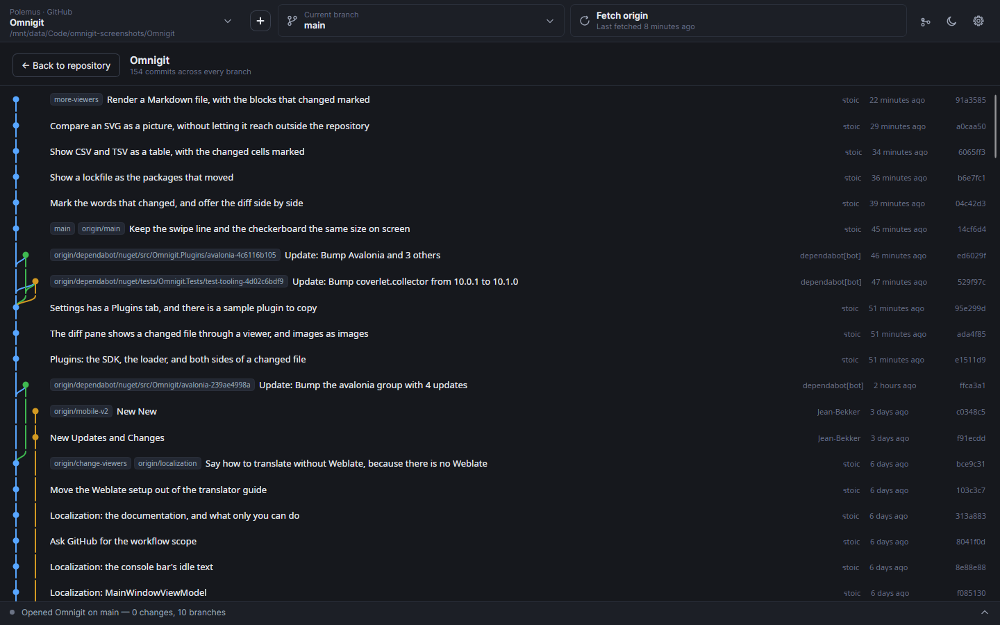

**Diff viewers — the same change shown the way that suits the file**

| | |
| --- | --- |
| 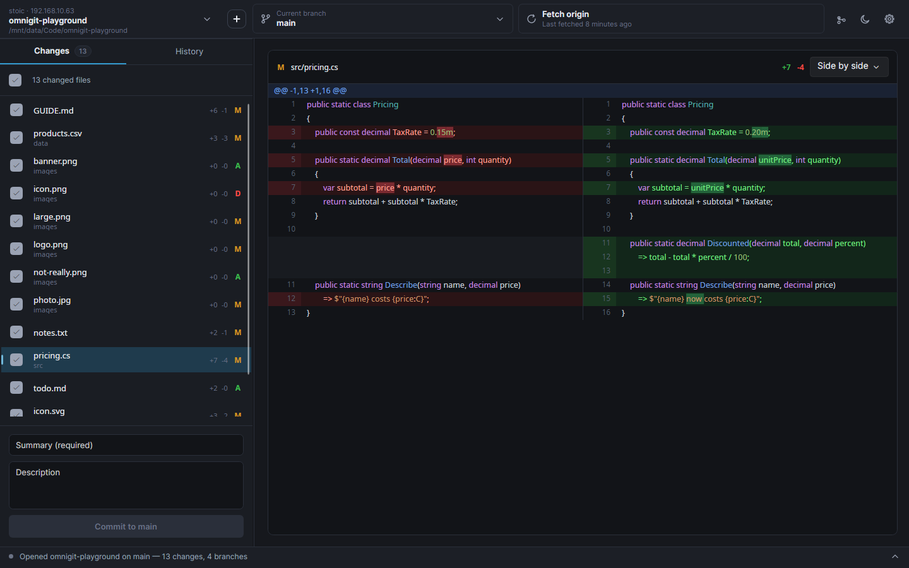 | 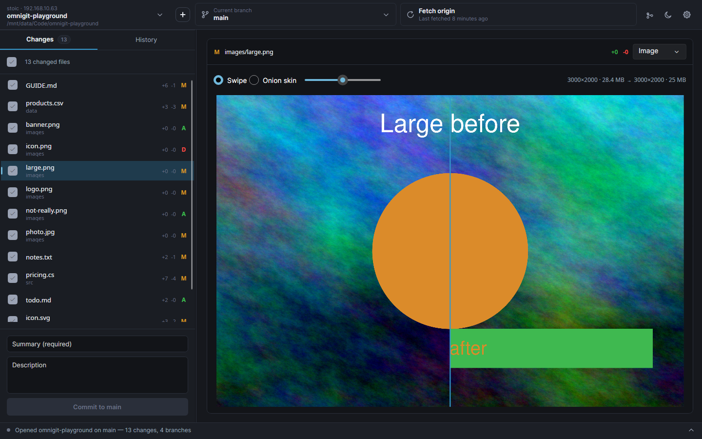 |
| **Side by side**, with the changed words picked out | **Image** — drag the line to wipe between old and new |
| 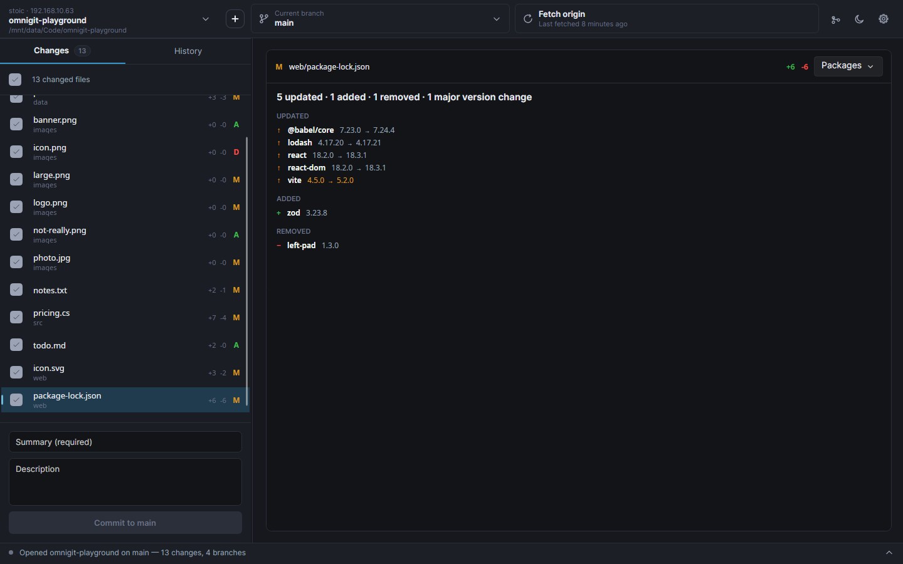 | 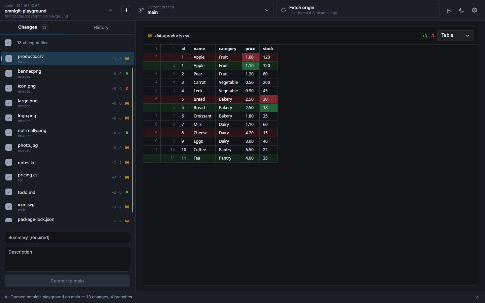 |
| **Packages** — a lockfile as what moved, majors in orange | **Table** — the changed cells of a CSV |
| 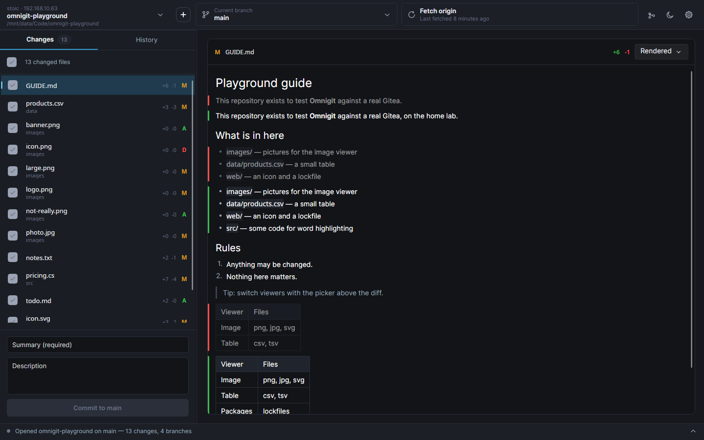 | 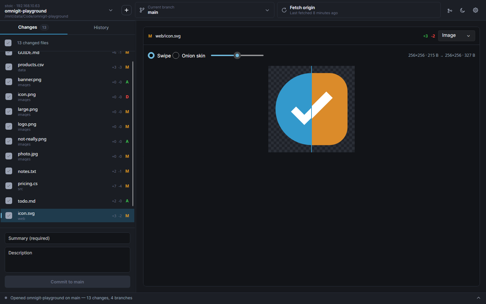 |
| **Rendered** Markdown, changed blocks marked in the margin | **SVG** compared as a picture |

**Finishing a revert that stopped on conflicts** — the conflicted file shows both sides with
the difference picked out, each file gets three answers, and the commit box is pre-filled
with the message Git prepared

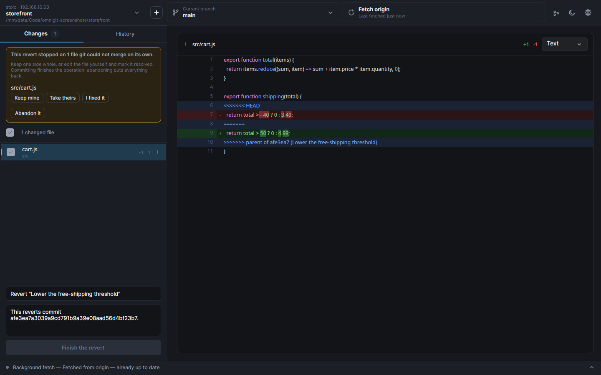

**Pull requests, listed for the repository you're on** — checking one out fetches its head
and lands you on `pr/<number>`; **Create pull request** pushes the branch first if the site
hasn't seen it

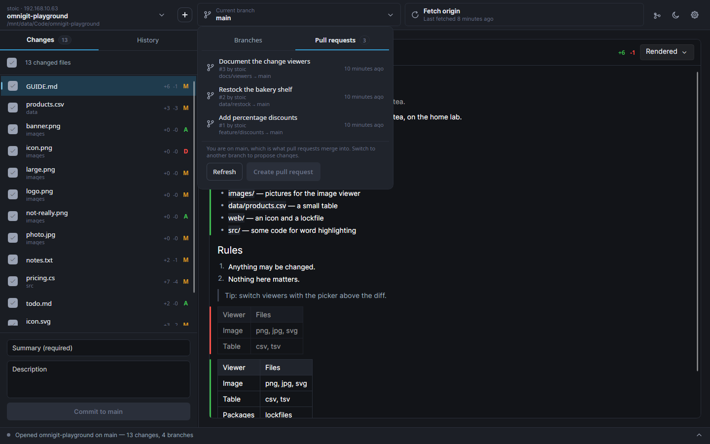

**Repository picker — grouped by the hosting site each clone actually came from**

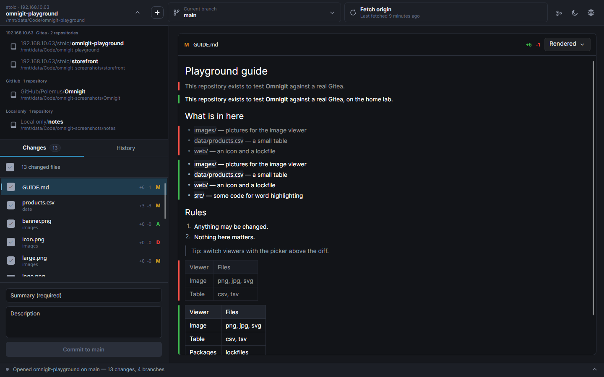

**New repository — created here, and published to a site in the same press if you pick one**

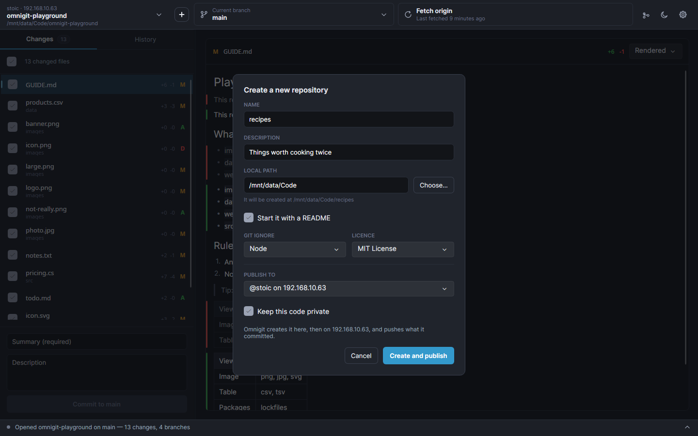

**Plugins — listed, and off until you switch them on**

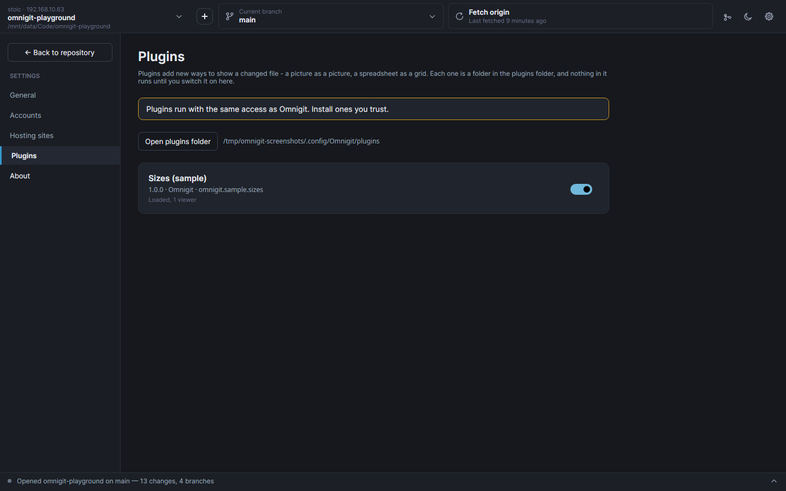

**Light theme**

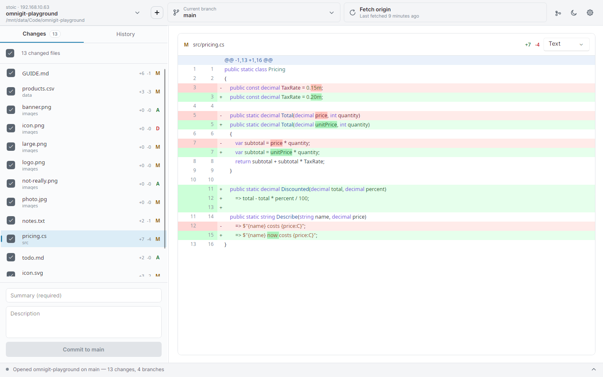

## Roadmap

Roughly in order of intent:

1. **Issues, and the rest of pull requests** — check/CI status, reviewing, merging.
   Listing, checking out and opening one all work; status is where the manifest format
   stops being enough, since GitHub's check-runs, Gitea's commit statuses and GitLab's
   pipelines agree on nothing.
2. **More viewers** — spreadsheets (`.xlsx`, `.ods`) and Godot scenes are next, then
   structured JSON and YAML that ignores reordering and reformatting.
3. **Removing a hosting site leaves its accounts orphaned.** They stay in the list with
   nothing able to talk to them. Should warn, or sign them out.
4. **Git credential-helper fallback**, so people who already use Git on the command line
   don't have to sign in again.
5. **Reordering commits** — the one thing missing from the commit menu. libgit2 has no
   todo-list rebase, so it means driving the rebase commit by commit with conflict handling
   at every step.
6. **Paging the history**, which currently stops at 100 commits (400 in the graph).
7. **Signing the Windows builds**, which needs a certificate from a commercial authority.

## Known limitations

- **Tests stop at the Git layer.** The pure functions, the viewers' comparisons and
  everything touching a repository are covered; the network and the whole UI are verified
  by hand against a real Gitea server.
- **Installers are ~50 MB**, because each build bundles the .NET runtime. `PublishTrimmed`
  would cut that substantially, but Avalonia needs trimming configuration and
  `ViewLocator`'s reflection would have to go first.

## Contributing

Issues and pull requests are welcome. The roadmap and limitations above are the honest
backlog — say so in an issue before starting on one, so two people don't write it twice.

| Document | What's in it |
| --- | --- |
| [docs/building.md](docs/building.md) | Running it, the project layout, the tests, building installers, cutting a release |
| [docs/architecture.md](docs/architecture.md) | The layers and *why* they're shaped this way |
| [docs/notes.md](docs/notes.md) | Decisions that look arbitrary and aren't, plus every Avalonia, libgit2 and code-signing trap already paid for |
| [docs/host-manifests.md](docs/host-manifests.md) | How to add a hosting site by writing one JSON file |
| [docs/plugins.md](docs/plugins.md) | Writing a viewer plugin |
| [docs/translating.md](docs/translating.md) | Translating it into your language, and adding a string so it can be translated |
| [docs/flatpak.md](docs/flatpak.md) | The sandbox, the checked-in NuGet lists, and building the Flatpak |
| [CONTRIBUTING.md](.github/CONTRIBUTING.md) | What a good pull request looks like |
| [SECURITY.md](.github/SECURITY.md) | Reporting a vulnerability privately, and what's in scope |

Quick start:

```bash
dotnet run --project src/Omnigit/Omnigit.csproj
dotnet test
```

Found a security problem? Don't open an issue —
[report it privately](https://github.com/Polemus/Omnigit/security/advisories/new).

### Translating

Omnigit is in English, and can be in yours. You do not need to write code or know git —
see **[docs/translating.md](docs/translating.md)**, which is one free editor and a file
upload until Omnigit is on a translation site.

A language ships at whatever percentage it has reached; anything untranslated shows in
English, so a partial translation is worth having and worth sending.

## Licence

MIT — see [LICENSE](LICENSE).

Release builds are self-contained, so they bundle the .NET runtime, Avalonia, Skia, libgit2
and a handful of libraries. [THIRD-PARTY-NOTICES.md](THIRD-PARTY-NOTICES.md) lists all of
it. The one worth knowing about is **libgit2**, which is GPLv2 — under a linking exception
that explicitly permits exactly this, so it places no obligation on Omnigit's own source or
yours.
